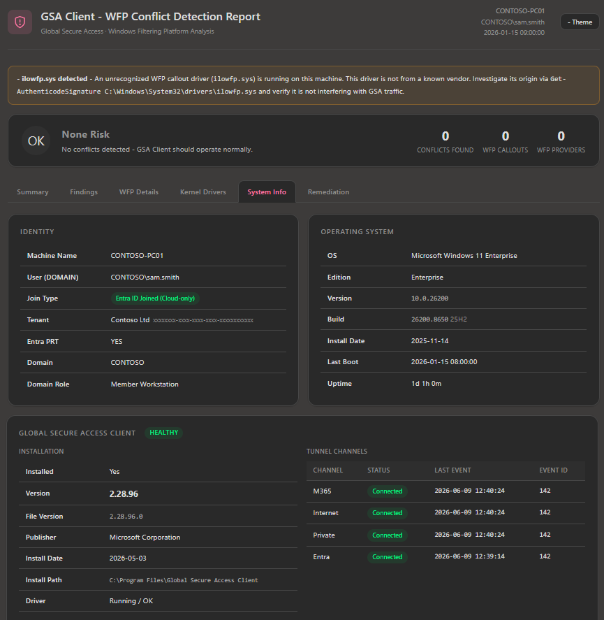

# GSA SxS Checker

[](https://docs.microsoft.com/en-us/powershell/)
[](https://www.microsoft.com/windows)
[](LICENSE)
[](https://github.com/jeevanbisht/GSASxSChecker/issues)

> **Detect potential conflicts with the Microsoft Global Secure Access (GSA) client by identifying coexisting network security products and their associated Windows Filtering Platform (WFP) drivers that may interfere with traffic interception, redirection, or filtering operations — in one command.**

The **Global Secure Access (GSA)** client uses a kernel-mode WFP callout driver to intercept and tunnel network traffic. Other security or network access products may register WFP callouts at the same network layers, sometimes leading to conflicts — tunnels fail to establish, traffic is silently dropped, or the machine becomes unstable.

`Get-GSAConflictReport.ps1` scans the local machine, compares running drivers against a curated conflict database, and generates a **self-contained, interactive HTML report** that is both engineering-level detailed and business-user friendly.

---

## ✨ Features

| Capability | Details |
|---|---|
| **50 vendor signatures** | Forcepoint, Check Point, Skyhigh, Zscaler, Netskope, Cloudflare One, iboss, Palo Alto Prisma/GlobalProtect, Cisco (6 products), Citrix Secure Access, Fortinet FortiClient, Ivanti/Pulse Secure, F5 BIG-IP Edge, SonicWall, Sophos, Absolute/NetMotion, Appgate SDP, Akamai EAA, Twingate, Trellix, Symantec, CrowdStrike, SentinelOne, OpenVPN, WireGuard, Tailscale, NetLimiter, Perimeter 81, NordLayer, Keeper Connection Manager, Open Systems SASE, Barracuda VPN, WatchGuard Mobile VPN, Array Networks VPN, Aruba VIA, Digital Guardian, Proofpoint Endpoint DLP, CoSoSys Endpoint Protector, ManageEngine DataSecurity Plus, Menlo Security, Ericom Shield, ZeroTier, NetBird, Headscale, Cato Networks |
| **WFP callout enumeration** | Live WFP engine dump via `netsh wfp show state` (requires Administrator) |
| **Kernel driver signer detection** | All running non-Microsoft kernel drivers with publisher and signer info |
| **GSA client status** | Version, services, tunnel channel health (M365 / Internet / Private / Entra) |
| **Entra ID join detection** | Cloud, Hybrid, On-prem, Workgroup — via `dsregcmd` |
| **Risk scoring** | None / Low / Medium / High banner with actionable remediation |
| **Self-contained HTML** | One `.html` file — no internet required, no server needed |
| **Dark / light mode** | Auto-detects OS preference, toggle in report header |

---

## 🚀 Quick Start

### 1. Download

```powershell
git clone https://github.com/jeevanbisht/GSASxSChecker.git
cd GSASxSChecker
```

Or download just the script:

```powershell
Invoke-WebRequest -Uri "https://raw.githubusercontent.com/jeevanbisht/GSASxSChecker/main/Get-GSAConflictReport.ps1" -OutFile "Get-GSAConflictReport.ps1"
```

### 2. Run (as Administrator for full results)

Right-click **PowerShell** → **Run as Administrator**, then:

```powershell
.\Get-GSAConflictReport.ps1
```

The report opens automatically in your default browser.

### 3. Review the report

Open `GSA-Conflict-Report.html` and navigate the tabs:

| Tab | What you'll see |
|---|---|
| **Summary** | Risk banner, machine snapshot, quick conflict count |
| **Findings** | Per-vendor risk level, matched drivers/services, conflict description |
| **WFP Details** | Raw WFP callout drivers and providers (admin-only) |
| **Kernel Drivers** | All running non-Microsoft kernel drivers with signer |
| **System Info** | Identity, OS, hardware, GSA client status, network adapters |
| **Remediation** | Vendor-specific actions and diagnostic commands to copy-paste |

---

## 📋 Requirements

- **OS**: Windows 10 / 11 or Windows Server 2016+
- **PowerShell**: 5.1 or later (built into Windows)
- **Elevation**: Run as **Administrator** for full WFP callout enumeration.  
  Without elevation the report still runs but WFP Callouts/Providers sections will be empty.

---

## 🔧 Parameters

```powershell
Get-Help .\Get-GSAConflictReport.ps1 -Full
```

| Parameter | Type | Default | Description |
|---|---|---|---|
| `-OutputPath` | `string` | `.\GSA-Conflict-Report.html` | Path for the generated report |
| `-NoBrowser` | `switch` | `$false` | Skip auto-opening the report in browser |

### Examples

```powershell
# Standard run
.\Get-GSAConflictReport.ps1

# Custom output path
.\Get-GSAConflictReport.ps1 -OutputPath "C:\Reports\GSA-$(hostname)-$(Get-Date -f yyyyMMdd).html"

# Silent (no browser pop-up — useful for automation)
.\Get-GSAConflictReport.ps1 -NoBrowser

# Remote machine — run locally on target, then collect
Invoke-Command -ComputerName TARGET-PC -FilePath .\Get-GSAConflictReport.ps1
```

---

## 🔍 How Detection Works

The GSA client registers a **kernel-mode WFP callout driver** that operates at Windows Filtering Platform layers `FWPM_LAYER_ALE_CONNECT_REDIRECT_V4/V6`. When a competing product also registers at these layers, the WFP filter weight/priority system determines who handles each network decision — often leading to conflicts.

**Detection pipeline:**

```
1. Win32_SystemDriver (WMI)   →  all SCM-registered kernel-mode drivers
2. netsh wfp show state        →  live WFP callout + provider enumeration (admin)
3. Vendor signature matching   →  50 curated vendor patterns
4. GSA registry / services     →  version, channel status, service health
5. dsregcmd /status            →  Entra ID / Hybrid / On-prem join detection
```

> **Scope:** Detects WFP callout drivers registered via the Windows Filtering Platform API.  
> Does NOT detect drivers loaded without SCM registration, or non-WFP hooks (NDIS filters, LSPs).

---

## 📸 Sample Report

See [`Sample-GSA-Conflict-Report.html`](Sample-GSA-Conflict-Report.html) for a live example (anonymized machine data).



---

## 🤝 Contributing

Contributions are welcome! See [CONTRIBUTING.md](CONTRIBUTING.md) for guidelines on adding new vendor signatures, improving detection, or fixing bugs.

---

## 📜 Changelog

See [CHANGELOG.md](CHANGELOG.md).

---

## 📄 License

MIT — see [LICENSE](LICENSE).

---

## 🔗 Related Resources

- [GSA Client known issues & troubleshooting](https://learn.microsoft.com/en-us/entra/global-secure-access/troubleshoot-global-secure-access-client-advanced-diagnostics)
- [Windows Filtering Platform architecture](https://learn.microsoft.com/en-us/windows/win32/fwp/windows-filtering-platform-start-page)
- [Global Secure Access documentation](https://learn.microsoft.com/en-us/entra/global-secure-access/)
